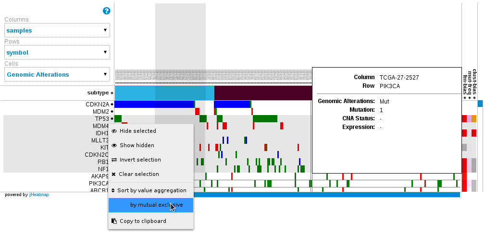

jHeatmap
========

Website
--------

Check the documentation and online examples here: 

http://jheatmap.github.io/jheatmap

- **Youtube video**: A showcase of jHeatmap https://www.youtube.com/watch?v=9bO1fCJhJyo

Citation
--------------

jHeatmap has been publishend in [Bioinformatics: Deu-Pons J, Schroeder MP, Lopez-Bigas N. jHeatmap: an interactive heatmap viewer for the web. Bioinformatics. 2014 Feb 23. doi:10.1093/bioinformatics/btu094](http://bioinformatics.oxfordjournals.org/content/30/12/1757.full).

Bug tracker
-----------

Have a bug? Please create an issue here on GitHub!

https://github.com/jheatmap/jheatmap/issues

Versioning
----------

Releases will be numbered with the follow format:

`<major>.<minor>.<patch>`

And constructed with the following guidelines:

* Breaking backward compatibility bumps the major
* New additions without breaking backward compatibility bumps the minor
* Bug fixes and misc changes bump the patch

For more information on SemVer, please visit <http://semver.org/>.

Authors
-------

**Jordi Deu-Pons**

+ <http://github.com/jordeu>

**Michael Schroeder**

+ <https://github.com/mpschr>

Copyright and license
---------------------

Copyright 2011 [Universitat Pompeu Fabra](http://www.upf.edu).

 Licensed under the Apache License, Version 2.0 (the "License");
 you may not use this file except in compliance with the License.
 You may obtain a copy of the License at

     <http://www.apache.org/licenses/LICENSE-2.0>

 Unless required by applicable law or agreed to in writing, software
 distributed under the License is distributed on an "AS IS" BASIS,
 WITHOUT WARRANTIES OR CONDITIONS OF ANY KIND, either express or implied.
 See the License for the specific language governing permissions and
 limitations under the License.

